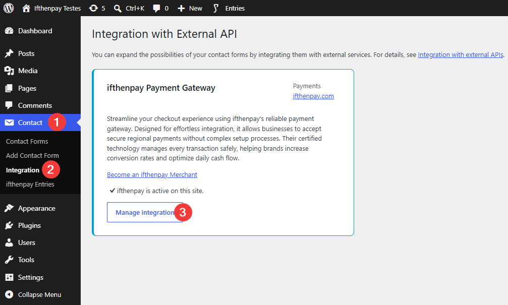
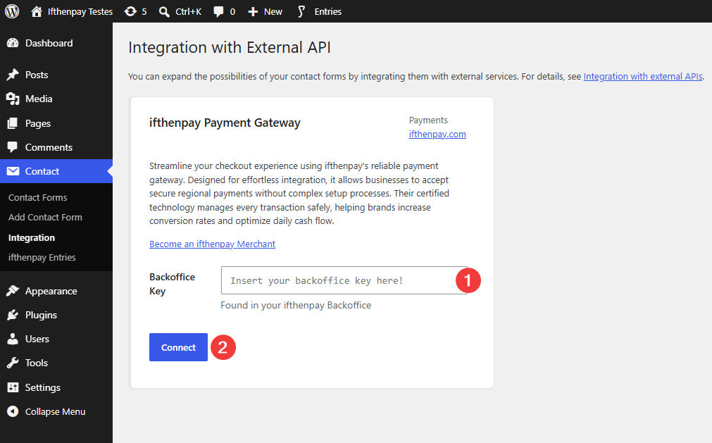
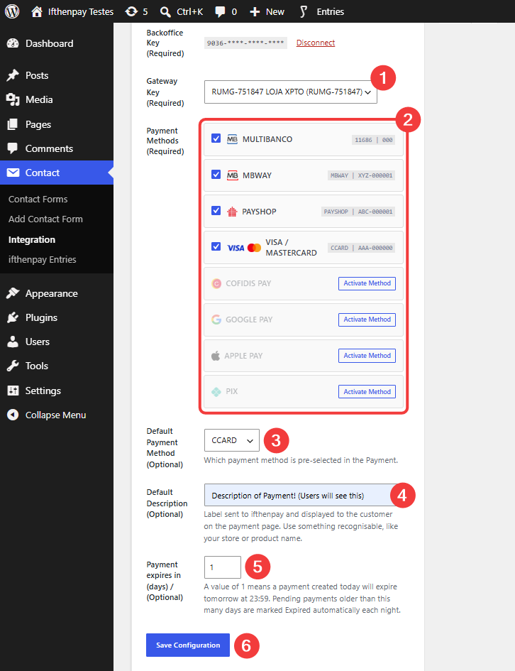
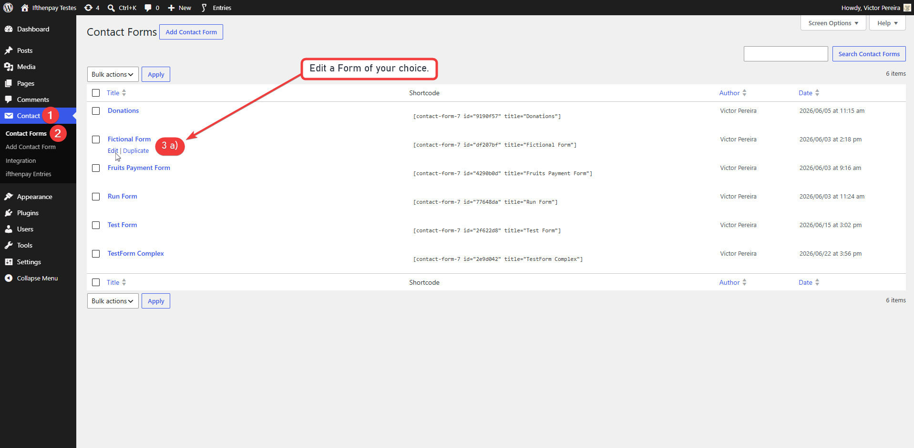
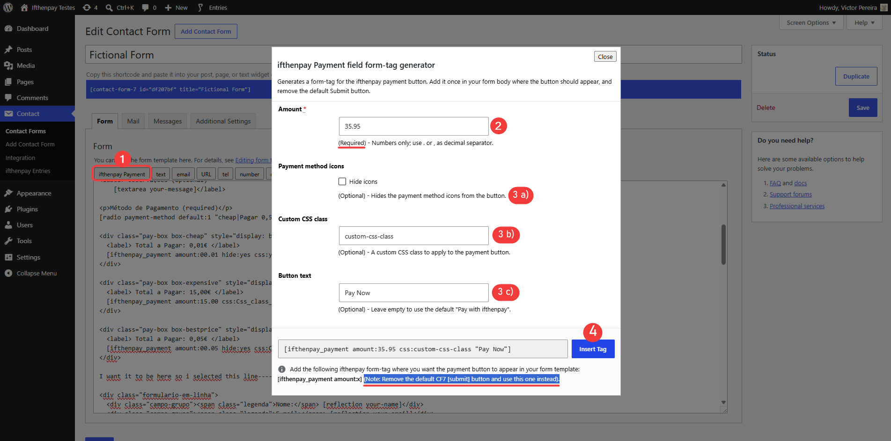
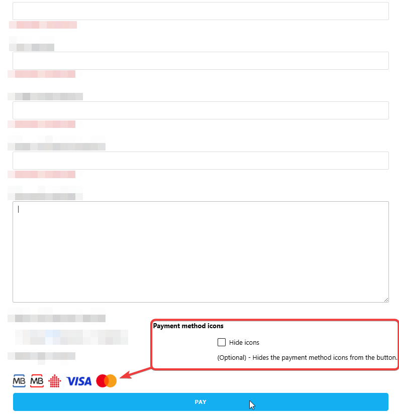
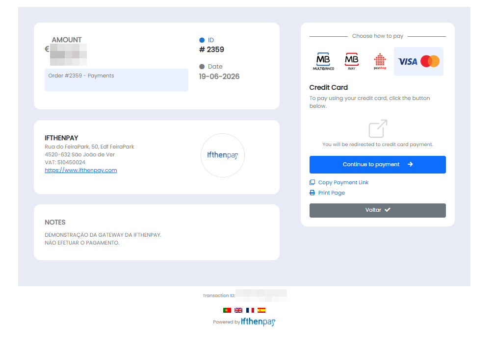
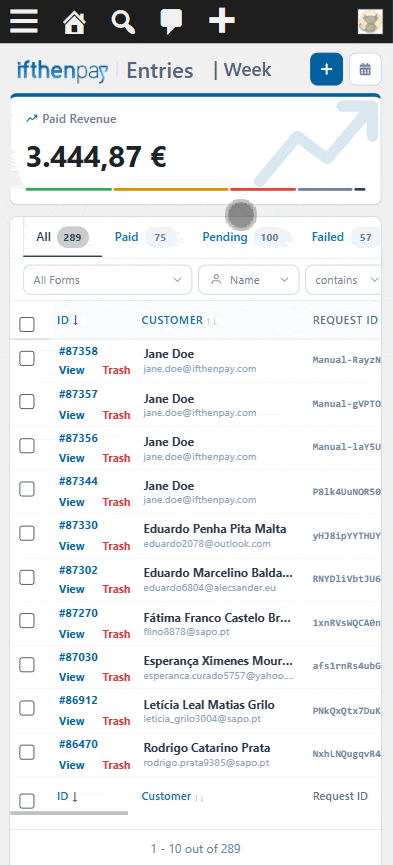

# ifthenpay | Payments for Contact Form 7

Adds ifthenpay payment methods to Contact Form 7: cards, wallets, and local payment options; supports secure one-time payments via pay-by-link.

---

## Table of Contents

- [Description](#description)
- [Key Features](#key-features)
- [Requirements](#requirements)
- [Installation](#installation)
- [Form Tag Reference](#form-tag-reference)
- [Frequently Asked Questions](#frequently-asked-questions)
- [External Services](#external-services)
- [Screenshots](#screenshots)
- [Support](#support)

## Description

This plugin integrates the ifthenpay payment gateway with Contact Form 7 to enable seamless payment collection directly from your forms.

Payments are processed through a secure pay-by-link system, ensuring that no sensitive card or banking data is stored on your website. After form submission, customers are redirected to a secure ifthenpay payment page where they finalize the transaction. ifthenpay then sends a server-side callback to automatically update the payment status in your entries.

### In plain terms you get:

* One-time payments directly from Contact Form 7 forms
* Secure automatic payment confirmations via callback
* Payment entries page to manage and track all transactions
* Revenue dashboard widget with period breakdown
* No card numbers stored on your website

All global settings are configured on the CF7 Integration page. Per-form settings (enable/disable, amount source) are managed inside each form editor.

## Key Features

1. Full integration with Contact Form 7 forms
2. Secure transactions via pay-by-link
3. Automatic payment confirmation via server-side callback
4. Support for multiple payment methods (cards, wallets, bank transfers)
5. Per-form configuration — enable payments and set amount source per form
6. Flexible amount — fixed price or read dynamically from any CF7 field
7. Payment entries page with filtering, search, bulk actions, and column customization
8. Revenue dashboard widget with last 24 h / 7 d / 15 d / 30 d breakdown
9. Admin bar shortcut and keyboard shortcut (`Ctrl+Shift+F`) to Entries page
10. Multi-language support (EN, ES, FR, PT)
11. Security-first — no card data stored, anti-phishing key validation, HTTPS only

## Requirements

* An active ifthenpay merchant account — [subscribe here](https://ifthenpay.com/aderir/) to obtain your credentials.
* The payment methods you want enabled (our helpdesk team will guide you).
* WordPress 6.5+.
* PHP 8.2+.
* Contact Form 7 5.9+ installed and activated.
* HTTPS (SSL) enabled on your site.

## Installation

1. **Install**: Upload the plugin zip via `Plugins → Add New → Upload`, or install from WordPress.org and Activate.
2. **Connect**: Go to `Contact Form 7 → Integration → ifthenpay Payment Gateway`, enter your Backoffice Key, and click **Connect**.
3. **Configure**: Select your Gateway Key, enable payment methods, set a default method, description, and expiry days. Click **Save Configuration**.
4. **Per-form setup**: Open any form, go to the **ifthenpay Payment Gateway** tab, enable payments, and configure the payment amount (fixed or from a CF7 field).
5. **Add the tag**: Use the tag generator inside the form editor or type the tag manually into the form body. Remove the default Submit button — the `[ifthenpay_payment]` tag acts as the submit.

## Form Tag Reference

The `[ifthenpay_payment]` tag renders the payment button in the form. Place it once where the submit button should appear and remove the default `[submit]` tag.

```
[ifthenpay_payment amount:30.00]
[ifthenpay_payment amount:30.00 "Buy now" css:btn-primary hide:yes]
```

| Option | Required | Description |
|--------|----------|-------------|
| `amount:X.XX` | Yes | Payment amount in euros. Use `.` or `,` as decimal separator. |
| `"Button text"` | No | Custom button label. Default: `Pay with ifthenpay`. |
| `css:"my-class"` | No | Extra CSS class appended to the button element. |
| `hide:yes` | No | Hides payment method logos displayed above the button. |

The tag generator in the form editor (Form editor → **ifthenpay Payment**) builds the tag for you with a visual UI.

## Frequently Asked Questions

<details>
<summary><strong>Does this plugin require Contact Form 7?</strong></summary>

Yes. Contact Form 7 must be installed and active to use this plugin.

Without Contact Form 7, the plugin has no forms to attach payments to and will show an admin notice.

</details>

<details>
<summary><strong>Does it support recurring payments?</strong></summary>

No. This version supports one-time payments via pay-by-link only.

</details>

<details>
<summary><strong>Are payment details stored?</strong></summary>

No. The plugin does not store card numbers or full bank details.

Only the minimal references required for payment matching and status updates are stored: transaction ID, amount, payment method, status, and form data.

</details>

<details>
<summary><strong>Which payment methods are supported?</strong></summary>

Any ifthenpay method attached to your Gateway Key, including:

* Multibanco
* MB WAY
* Payshop
* Credit Card
* Cofidis
* Google Pay
* Apple Pay
* Pix

</details>

<details>
<summary><strong>How does the payment process work?</strong></summary>

After form submission, customers are redirected to a secure payment page hosted by ifthenpay. Once payment is completed, ifthenpay sends a server-side callback to automatically update the entry status.

</details>

<details>
<summary><strong>What happens if a payment fails or is cancelled?</strong></summary>

The entry is marked as Failed or Cancelled. The payment can be retried by re-submitting the form.

</details>

<details>
<summary><strong>Where are payment entries stored?</strong></summary>

In a custom database table `wp_ifthenpay_cf7_entries`. View and manage them under **Contact Form 7 → ifthenpay Entries**.

</details>

<details>
<summary><strong>When do pending payments expire?</strong></summary>

A daily cron job runs at 23:59 and marks pending payments older than the configured number of days (default: 3) as expired. You can adjust the expiry period on the Integration settings page.

</details>

<details>
<summary><strong>Can the payment amount come from a form field?</strong></summary>

Yes. In the per-form settings (form editor → **ifthenpay Payment Gateway** tab), set Payment Amount to **Read from CF7 field** and enter the field name whose value holds the amount.

</details>

<details>
<summary><strong>Is there a sandbox / test mode?</strong></summary>

ifthenpay may provide test entities for development and testing purposes. If unavailable, we recommend using a low-value live transaction.

</details>

<details>
<summary><strong>How secure is the integration?</strong></summary>

All requests are encrypted over HTTPS and no sensitive payment data is stored on your website. The callback endpoint validates an anti-phishing key and verifies the payment amount before updating any entry.

</details>

<details>
<summary><strong>Why are payment links failing or setup timing out?</strong></summary>

Your server firewall or VPN may be blocking outbound requests. The plugin must connect to ifthenpay APIs to function. Ensure your network administrator allows outbound HTTPS traffic to ifthenpay domains.

</details>

## External Services

This plugin integrates with the ifthenpay payment platform to process payments for Contact Form 7 submissions. ifthenpay is a third-party service that provides secure payment processing for cards, wallets, and local bank transfers.

- **Contact Form 7**
  - **What it is and what it is used for**: A free form builder plugin used to create contact and payment forms. This plugin extends its capabilities by adding a payment button tag and processing.

- **Gravatar (Automattic)**
  - **What it is and what it is used for:** A profile image service used to retrieve and display the sender's avatar next to their form submission on the plugin's administration entries page.
  - **What data is sent and when:** An anonymized string created from the user's email address (also called a hash) is sent to the Gravatar service whenever an administrator views the Single Entry Page.
  - **Automattic Terms of Service:** [Terms of Service](https://automattic.com)
  - **Automattic Privacy Policy:** [Privacy Policy](https://automattic.com).

- **ifthenpay Backoffice & Integrations**
  - **What it is and what it is used for**: The ifthenpay Backoffice is the merchant dashboard used to manage integrations and payment configurations. The plugin uses the ifthenpay API to generate payment links and validate transactions.
  - **What data is sent and when**:
    - During setup: Backoffice Key and Gateway Key for authentication and configuration retrieval.
    - During payment processing: Transaction ID, amount, description, enabled payment method accounts, success/error/cancel return URLs, language, and optionally the selected payment method, customer email, customer name, and form field data.
    - During callbacks: Payment status, Transaction ID, and payment method (received from ifthenpay).
  - **Network & VPN Requirements**: Outbound HTTPS requests are made to ifthenpay APIs for setup, link generation, and status validation. Servers behind strict firewalls or restrictive outbound VPNs must allowlist the following domains to prevent connection timeouts:
    - [api.ifthenpay.com](https://api.ifthenpay.com)
    - [ifthenpay.com](https://ifthenpay.com)


  - **End-User License Agreement (EULA)**: [EULA](https://ifthenpay.com/eula/)
  - **Privacy Policy**: [Privacy Policy](https://ifthenpay.com/politica-de-privacidade/)

All network requests are performed server-side over HTTPS. Sensitive credentials are stored securely and are not publicly exposed. No raw card or bank details are stored.

## Screenshots

Below are screenshots demonstrating key features and interfaces of the plugin:

1. **(Admin Only) CF7 Integration page — Integration Card View**
   
2. **(Admin Only) CF7 Integration page — Backoffice Key setup**
   
3. **(Admin Only) CF7 Integration page — Gateway Key & payment methods configuration**
   
4. **(Admin Only) Entering a CF7 form of your choice**
   
5. **(Admin Only) Tag Generator in the form editor - ifthenpay Payment Gateway tab (per-form settings)**
   
6. **(Customer Experience) Frontend form with payment button and method logos**
   
7. **(Customer Experience) ifthenpay payment window**
   
8. **(Admin Only) ifthenpay Entries page — Table Options & Features**
   
9. **(Admin Only) ifthenpay Entries page — Status Selection | Add Payment | Single Entry Info**
   
10. **(Admin Only) ifthenpay Entries page — Mobile Version**
   <p align="center">
      
   </p>

## Support

For assistance use the [WordPress.org support forum](https://wordpress.org/support/plugin/ifthenpay-payments-for-contactform7):

Pre-checks:
- Payment method enabled on Gateway Key AND mapped to Integration
- Running current recommended versions of WordPress, PHP, & Contact Form 7

Commercial helpdesk available (no direct email required): [helpdesk.ifthenpay.com](https://helpdesk.ifthenpay.com/)

- **ifthenpay support**: [suporte@ifthenpay.com](mailto:suporte@ifthenpay.com)
- **Contact Form 7 docs**: [CF7 docs](https://contactform7.com/docs/)
